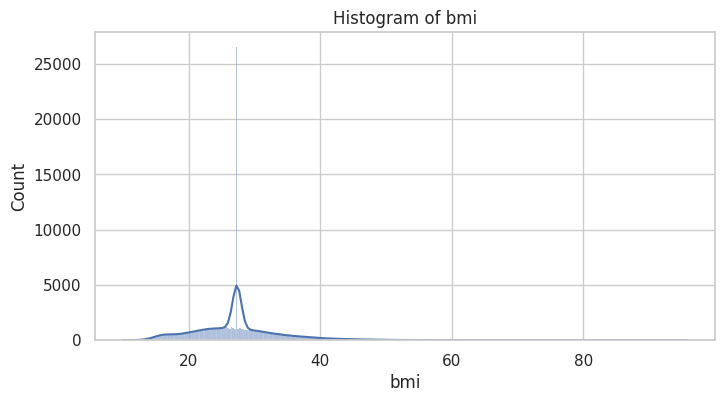
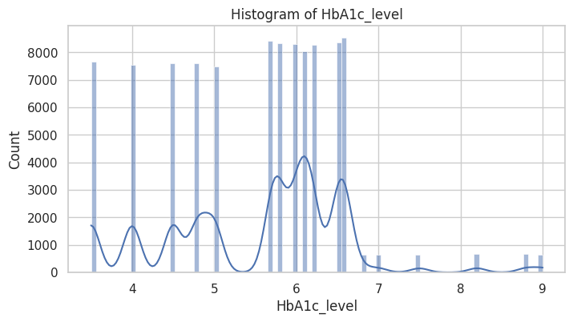
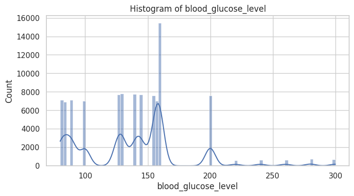
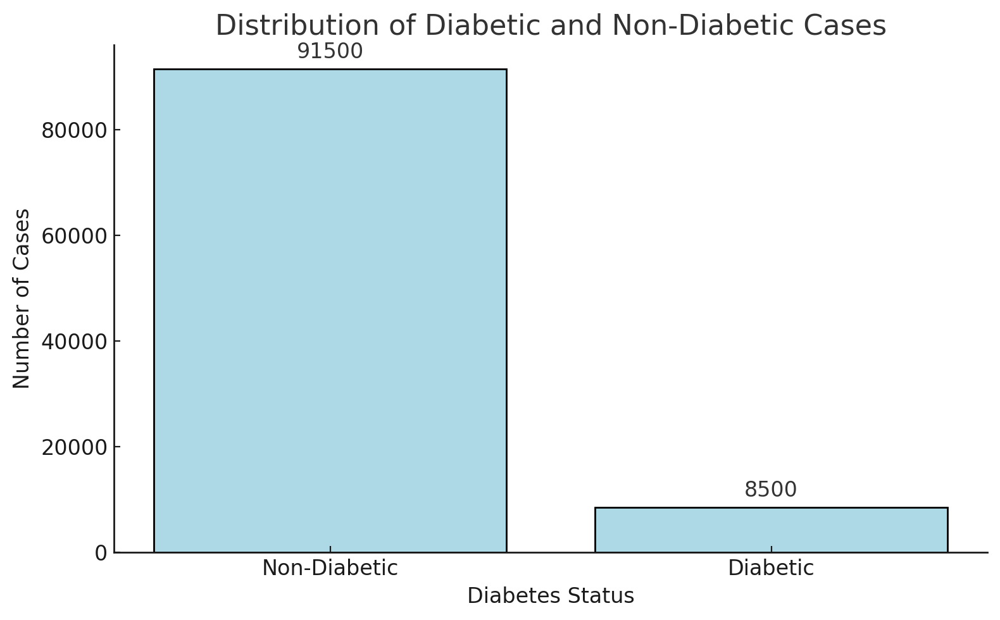

# Predicting Diabetes Using Machine Learning and Deep Learning Models

> This README acts as our **one page** presentation answering the questions as well as presenting the results of our project.

**Presenters**: `Raja Allmdar Tariq Ali` and `Avinash Pandey`

## Introduction
- Our objective was to develop a predictive model for diabetes using machine learning and deep learning techniques
- The motivation behind this project was to address the rising global challenge of diabetes and the potential of predictive analytics
- Data was [sourced from kaggle](https://www.kaggle.com/datasets/iammustafatz/diabetes-prediction-dataset)

## Data Overview
- Features
  - **Numerical**: Age, BMI, HbA1c level, Blood Glucose Level
   - **Categorical**: Gender, Hypertension, Heart Disease, Smoking History

- Target Variable 
  - **Diabetes**: 0 (No Diabetes), 1 (Diabetes)
- There were no missing values in the dataset

| Attribute             | Count       | Mean       | Std Dev     | Min    | 25%    | 50%    | 75%    | Max     |
|-----------------------|-------------|------------|-------------|--------|--------|--------|--------|---------|
| Age                   | 100,000     | 41.89      | 22.52       | 0.08   | 24.00  | 43.00  | 60.00  | 80.00   |
| BMI                   | 100,000     | 27.32      | 6.64        | 10.01  | 23.63  | 27.32  | 29.58  | 95.69   |
| HbA1c Level           | 100,000     | 5.53       | 1.07        | 3.50   | 4.80   | 5.80   | 6.20   | 9.00    |
| Blood Glucose Level   | 100,000     | 138.06     | 40.71       | 80.00  | 100.00 | 140.00 | 159.00 | 300.00  |

**Fig 1**: Data Distribution of Numerical Features

**Fig 2:** Histogram of Age

**Fig 3:** Histogram of BMI

**Fig 4:** Histogram of HbA1c Level

**Fig 5:** Histogram of Blood Glucose Level

**Fig 6:** Data Distribution of Diabetic and Non-diabetic Patients

## Challenges in Data Cleaning and Preprocessing
1. **Handling Outliers**: 
   - The Body Mass Index (BMI) feature exhibited extreme values, indicating the presence of outliers that could potentially skew the model's performance
   - Outliers can distort certain statistical measures like the mean and standard deviation.
   - They may mislead the learning algorithms, causing inaccurate predictions
   - **Solution**: We used the Interquartile Range (IQR) method to detect and remove outliers from the BMI feature

## Exploratory Data Analysis

## Model Selection

## Model Implementation and Evaluation

## Key Factors Influencing Model Performance

## Interpretation of Results

## Insights from Data and Analysis

## Conclusion
