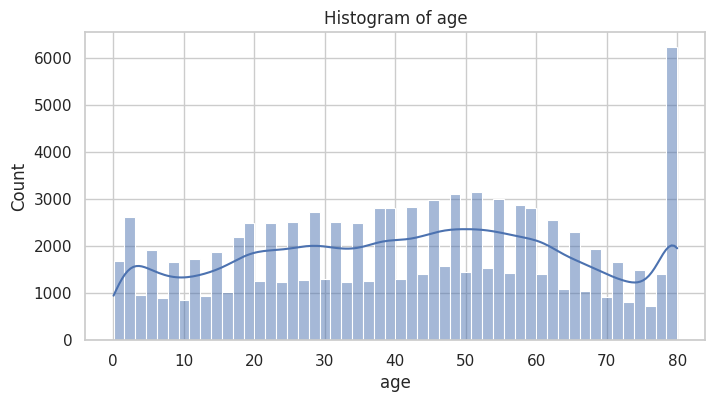

# Predicting Diabetes Using Machine Learning and Deep Learning Models

> This README acts as our **one page** presentation answering the questions as well as presenting the results of our project.

**Presenters**: `Raja Allmdar Tariq Ali` and `Avinash Pandey`

## Introduction
- Our objective was to develop a predictive model for diabetes using machine learning and deep learning techniques
- The motivation behind this project was to address the rising global challenge of diabetes and the potential of predictive analytics

**Fig :** Number of new T2DM, and incidence rate of T2DM across Brazil, China, India, Russian Federation, and South Africa between 1990 and 2019
- Data was [sourced from kaggle](https://www.kaggle.com/datasets/iammustafatz/diabetes-prediction-dataset)

## Data Overview
- Features
  - **Numerical**: Age, BMI, HbA1c level, Blood Glucose Level
   - **Categorical**: Gender, Hypertension, Heart Disease, Smoking History

- Target Variable 
  - **Diabetes**: 0 (No Diabetes), 1 (Diabetes)
- There were no missing values in the dataset

| Attribute             | Count       | Mean       | Std Dev     | Min    | 25%    | 50%    | 75%    | Max     |
|-----------------------|-------------|------------|-------------|--------|--------|--------|--------|---------|
| Age                   | 100,000     | 41.89      | 22.52       | 0.08   | 24.00  | 43.00  | 60.00  | 80.00   |
| BMI                   | 100,000     | 27.32      | 6.64        | 10.01  | 23.63  | 27.32  | 29.58  | 95.69   |
| HbA1c Level           | 100,000     | 5.53       | 1.07        | 3.50   | 4.80   | 5.80   | 6.20   | 9.00    |
| Blood Glucose Level   | 100,000     | 138.06     | 40.71       | 80.00  | 100.00 | 140.00 | 159.00 | 300.00  |

**Fig :** Data Distribution of Numerical Features

**Fig :** Histogram of Age

**Fig :** Histogram of BMI

**Fig :** Histogram of HbA1c Level

**Fig :** Histogram of Blood Glucose Level

**Fig :** Data Distribution of Diabetic and Non-diabetic Patients

**Fig:** Data Distribution of Categorical Column `Gender`

**Fig:** Data Distribution of Categorical Column `smoking_history`

**Fig:** Histogram of `hypertension`

**Fig:** Histogram of `heart_disease`

## Challenges in Data Cleaning and Preprocessing
1. **Handling Outliers**: 
   - The Body Mass Index (BMI) feature indicated extreme values, indicating the presence of outliers that could potentially skew the model's performance
   - Outliers can distort certain statistical measures like the mean and standard deviation.
   - They may mislead the learning algorithms, causing inaccurate predictions
   - **Solution**: We used the Interquartile Range (IQR) method to detect and remove outliers from the BMI feature
      - This is the lower bound being used for outlier detection: `14.705`
      - This is the upper bound being used for outlier detection: `38.504999999999995`
      - Number of Outliers Detected in BMI: `7086`

**Fig :** Boxplot of BMI

**Fig :** Class Distribution Before and After Outlier Removal

2. **Handling Imbalanced Data**:
   - The dataset was imbalanced with a higher number of non-diabetic patients compared to diabetic patients
   - Imbalanced data can lead to biased models that predict the majority class more accurately than the minority class
   - **Solution**: We applied multiple techniques such as `Synthetic Minority Oversampling Technique` (SMOTE) and  `SMOTE-Tomek` to balance classes *[More details regarding these techniques will be discussed later]*

3. **Categorical Variables Encoding**:
   - The dataset contained categorical variables that needed to be encoded for the machine learning models
   - **Solution**: We used the `One-Hot Encoding` technique to convert categorical variables into numerical form

4. Ambiguities in smoking history categories (e.g., `"ever"`)
    - Not Current = Refers to individuals who used to smoke but are currently not smoking
    - Former = Individuals who used to smoke but are currently not smoking AND have been abstinent for a longer period of time than those in the "not current" category.
    - Current = Indicates that the individual is currently a smoker at the time of data collection. It means that the person is actively smoking or has reported smoking recently.
    - Ever = Represents individuals who have ever smoked in their lifetime, regardless of their current smoking status (e.g. Current and Former). It includes individuals who are currently smoking ("Current"), as well as those who have previously smoked but may have quit at the time of data collection ("Former").
    - The "ever" category was ambiguous as it could include both current and former smokers, making it challenging to interpret the data accurately. Therefore, we decided to drop this category from the analysis.

## Exploratory Data Analysis

## Model Selection

## Model Implementation and Evaluation

## Key Factors Influencing Model Performance

## Interpretation of Results

## Insights from Data and Analysis

## Conclusion
